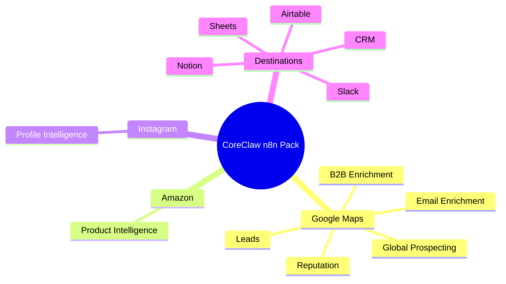
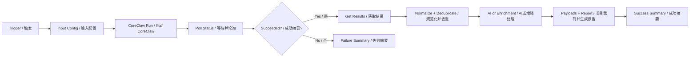

# CoreClaw n8n Commercial Workflow Pack

This repository provides mature CoreClaw-first n8n workflows. Every workflow includes bilingual node names and detailed English/Chinese sticky notes.

## Setup

1. Import the JSON workflow into n8n.
2. Select your CoreClaw API credential on each CoreClaw node.
3. Replace `YOUR_LLM_API_KEY` in HTTP Request nodes if AI is used.
4. Edit `Input Config / 输入配置`.
5. Run manually and inspect `Success Summary / 成功摘要`.

## Workflow Map

## Workflows

### CoreClaw地图线索 / Maps Leads

- **File:** `coreclaw-gmaps-leads-simple.json`
- **Use case:** Google Maps local lead scraping
- **Parameter example:** `keyword=dentist, base_location=Austin, Texas, USA, max_results=3`
- **How it helps:** Converts raw CoreClaw data into scored, deduplicated, business-ready records with reporting and downstream payloads.

### CoreClaw地图邮箱 / Maps Email

- **File:** `coreclaw-gmaps-leads-email-extraction-simple.json`
- **Use case:** Google Maps leads with website email discovery
- **Parameter example:** `keyword=dentist, base_location=Austin, Texas, USA, max_results=3`
- **How it helps:** Converts raw CoreClaw data into scored, deduplicated, business-ready records with reporting and downstream payloads.

### CoreClaw B2B增强 / B2B Enrich

- **File:** `coreclaw-gmaps-b2b-enrichment-simple.json`
- **Use case:** B2B lead enrichment with AI analysis
- **Parameter example:** `keyword=dentist, base_location=Austin, Texas, USA, max_results=3`
- **How it helps:** Converts raw CoreClaw data into scored, deduplicated, business-ready records with reporting and downstream payloads.

### CoreClaw评论监控 / Reviews Monitor

- **File:** `coreclaw-gmaps-reviews-monitor-simple.json`
- **Use case:** Review and reputation monitoring
- **Parameter example:** `keyword=dentist, base_location=Austin, Texas, USA, max_results=2, max_reviews_per_place=3`
- **How it helps:** Converts raw CoreClaw data into scored, deduplicated, business-ready records with reporting and downstream payloads.

### CoreClaw表格线索 / Sheets Leads

- **File:** `coreclaw-gmaps-to-sheets.json`
- **Use case:** Advanced Sheets-ready lead operations
- **Parameter example:** `keyword=dentist, base_location=Austin, Texas, USA, max_results=3`
- **How it helps:** Converts raw CoreClaw data into scored, deduplicated, business-ready records with reporting and downstream payloads.

### CoreClaw外联线索 / Email Outreach

- **File:** `coreclaw-gmaps-leads-email-extraction.json`
- **Use case:** Advanced email outreach pipeline
- **Parameter example:** `keyword=dentist, base_location=Austin, Texas, USA, fetch_social_info=true`
- **How it helps:** Converts raw CoreClaw data into scored, deduplicated, business-ready records with reporting and downstream payloads.

### CoreClaw Airtable管道 / Airtable Pipeline

- **File:** `coreclaw-gmaps-airtable-email.json`
- **Use case:** Airtable/CRM lead pipeline
- **Parameter example:** `keyword=dentist, base_location=Austin, Texas, USA, max_results=3`
- **How it helps:** Converts raw CoreClaw data into scored, deduplicated, business-ready records with reporting and downstream payloads.

### CoreClaw完整线索运营 / Lead Ops

- **File:** `coreclaw-gmaps-leads-complete-enhanced.json`
- **Use case:** Complete multi-destination lead operations
- **Parameter example:** `keyword=dentist, base_location=Austin, Texas, USA, max_results=3`
- **How it helps:** Converts raw CoreClaw data into scored, deduplicated, business-ready records with reporting and downstream payloads.

### CoreClaw口碑运营 / Reputation Ops

- **File:** `coreclaw-gmaps-reviews-monitor.json`
- **Use case:** Advanced reputation operations
- **Parameter example:** `keyword=dentist, base_location=Austin, Texas, USA, fetch_reviews=true`
- **How it helps:** Converts raw CoreClaw data into scored, deduplicated, business-ready records with reporting and downstream payloads.

### CoreClaw全球拓客 / Global Prospecting

- **File:** `coreclaw-google-maps-leads-complete-global.json`
- **Use case:** Global local-business prospecting
- **Parameter example:** `keyword=restaurant, base_location=Singapore, max_results=3`
- **How it helps:** Converts raw CoreClaw data into scored, deduplicated, business-ready records with reporting and downstream payloads.

### CoreClaw亚马逊情报 / Amazon Intel

- **File:** `coreclaw-amazon-product-intelligence.json`
- **Use case:** Amazon product intelligence
- **Parameter example:** `domain=https://www.amazon.com, keyword=coffee grinder, limit=3`
- **How it helps:** Converts raw CoreClaw data into scored, deduplicated, business-ready records with reporting and downstream payloads.

### CoreClaw Instagram账号情报 / Instagram Intel

- **File:** `coreclaw-instagram-profile-intelligence.json`
- **Use case:** Instagram profile intelligence
- **Parameter example:** `username=instagram, limit=1`
- **How it helps:** Converts raw CoreClaw data into scored, deduplicated, business-ready records with reporting and downstream payloads.

## Security

No public workflow JSON contains private CoreClaw or LLM keys. Use n8n credentials or environment variables for production.
