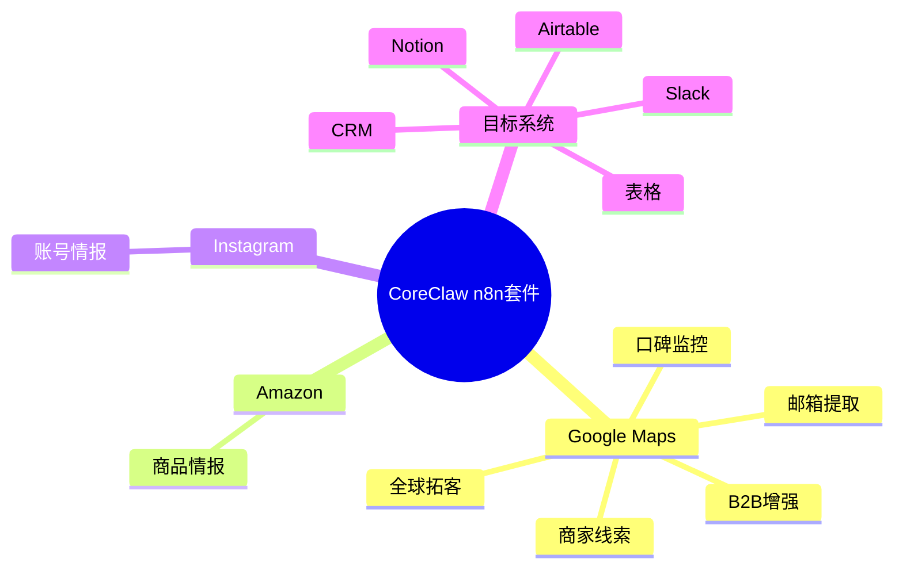
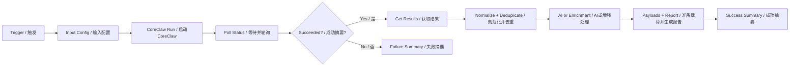

# CoreClaw n8n 商业工作流套件

本仓库提供成熟的 CoreClaw 优先 n8n 工作流。每个工作流都包含中英双语节点命名和详细中英文贴纸说明。

## 使用步骤

1. 在 n8n 中导入 JSON 工作流。
2. 在每个 CoreClaw 节点选择 CoreClaw API 凭证。
3. 如果使用 AI，请替换 HTTP Request 节点中的 `YOUR_LLM_API_KEY`。
4. 修改 `Input Config / 输入配置`。
5. 手动运行并检查 `Success Summary / 成功摘要`。

## 总体思维导图

## 工作流说明

### CoreClaw地图线索 / Maps Leads

- **文件:** `coreclaw-gmaps-leads-simple.json`
- **使用场景:** Google Maps本地商家线索抓取
- **参数示例:** `keyword=dentist, base_location=Austin, Texas, USA, max_results=3`
- **业务作用:** 将 CoreClaw 原始结果转换为已评分、已去重、可对接业务系统的数据记录。

### CoreClaw地图邮箱 / Maps Email

- **文件:** `coreclaw-gmaps-leads-email-extraction-simple.json`
- **使用场景:** Google Maps线索与官网邮箱提取
- **参数示例:** `keyword=dentist, base_location=Austin, Texas, USA, max_results=3`
- **业务作用:** 将 CoreClaw 原始结果转换为已评分、已去重、可对接业务系统的数据记录。

### CoreClaw B2B增强 / B2B Enrich

- **文件:** `coreclaw-gmaps-b2b-enrichment-simple.json`
- **使用场景:** B2B线索AI增强
- **参数示例:** `keyword=dentist, base_location=Austin, Texas, USA, max_results=3`
- **业务作用:** 将 CoreClaw 原始结果转换为已评分、已去重、可对接业务系统的数据记录。

### CoreClaw评论监控 / Reviews Monitor

- **文件:** `coreclaw-gmaps-reviews-monitor-simple.json`
- **使用场景:** 评论与口碑监控
- **参数示例:** `keyword=dentist, base_location=Austin, Texas, USA, max_results=2, max_reviews_per_place=3`
- **业务作用:** 将 CoreClaw 原始结果转换为已评分、已去重、可对接业务系统的数据记录。

### CoreClaw表格线索 / Sheets Leads

- **文件:** `coreclaw-gmaps-to-sheets.json`
- **使用场景:** 高级表格线索运营
- **参数示例:** `keyword=dentist, base_location=Austin, Texas, USA, max_results=3`
- **业务作用:** 将 CoreClaw 原始结果转换为已评分、已去重、可对接业务系统的数据记录。

### CoreClaw外联线索 / Email Outreach

- **文件:** `coreclaw-gmaps-leads-email-extraction.json`
- **使用场景:** 高级邮箱外联线索流程
- **参数示例:** `keyword=dentist, base_location=Austin, Texas, USA, fetch_social_info=true`
- **业务作用:** 将 CoreClaw 原始结果转换为已评分、已去重、可对接业务系统的数据记录。

### CoreClaw Airtable管道 / Airtable Pipeline

- **文件:** `coreclaw-gmaps-airtable-email.json`
- **使用场景:** Airtable/CRM线索管道
- **参数示例:** `keyword=dentist, base_location=Austin, Texas, USA, max_results=3`
- **业务作用:** 将 CoreClaw 原始结果转换为已评分、已去重、可对接业务系统的数据记录。

### CoreClaw完整线索运营 / Lead Ops

- **文件:** `coreclaw-gmaps-leads-complete-enhanced.json`
- **使用场景:** 完整多目标线索运营
- **参数示例:** `keyword=dentist, base_location=Austin, Texas, USA, max_results=3`
- **业务作用:** 将 CoreClaw 原始结果转换为已评分、已去重、可对接业务系统的数据记录。

### CoreClaw口碑运营 / Reputation Ops

- **文件:** `coreclaw-gmaps-reviews-monitor.json`
- **使用场景:** 高级口碑运营
- **参数示例:** `keyword=dentist, base_location=Austin, Texas, USA, fetch_reviews=true`
- **业务作用:** 将 CoreClaw 原始结果转换为已评分、已去重、可对接业务系统的数据记录。

### CoreClaw全球拓客 / Global Prospecting

- **文件:** `coreclaw-google-maps-leads-complete-global.json`
- **使用场景:** 全球本地商家拓客
- **参数示例:** `keyword=restaurant, base_location=Singapore, max_results=3`
- **业务作用:** 将 CoreClaw 原始结果转换为已评分、已去重、可对接业务系统的数据记录。

### CoreClaw亚马逊情报 / Amazon Intel

- **文件:** `coreclaw-amazon-product-intelligence.json`
- **使用场景:** 亚马逊商品情报
- **参数示例:** `domain=https://www.amazon.com, keyword=coffee grinder, limit=3`
- **业务作用:** 将 CoreClaw 原始结果转换为已评分、已去重、可对接业务系统的数据记录。

### CoreClaw Instagram账号情报 / Instagram Intel

- **文件:** `coreclaw-instagram-profile-intelligence.json`
- **使用场景:** Instagram账号情报
- **参数示例:** `username=instagram, limit=1`
- **业务作用:** 将 CoreClaw 原始结果转换为已评分、已去重、可对接业务系统的数据记录。

## 安全说明

公开工作流 JSON 不包含私有 CoreClaw API Key 或大模型 Key。生产环境建议使用 n8n 凭证或环境变量。
